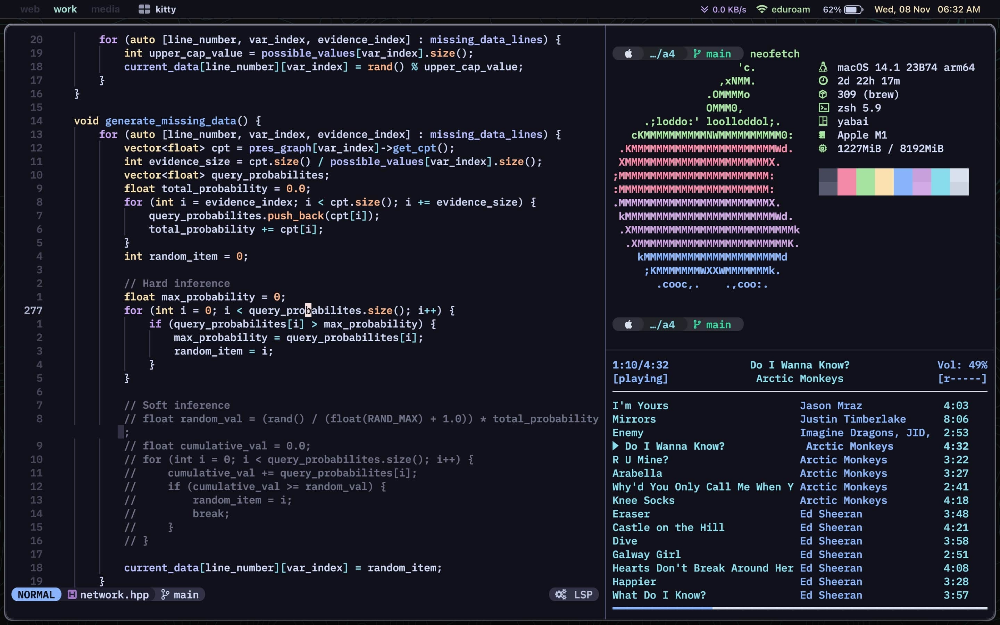
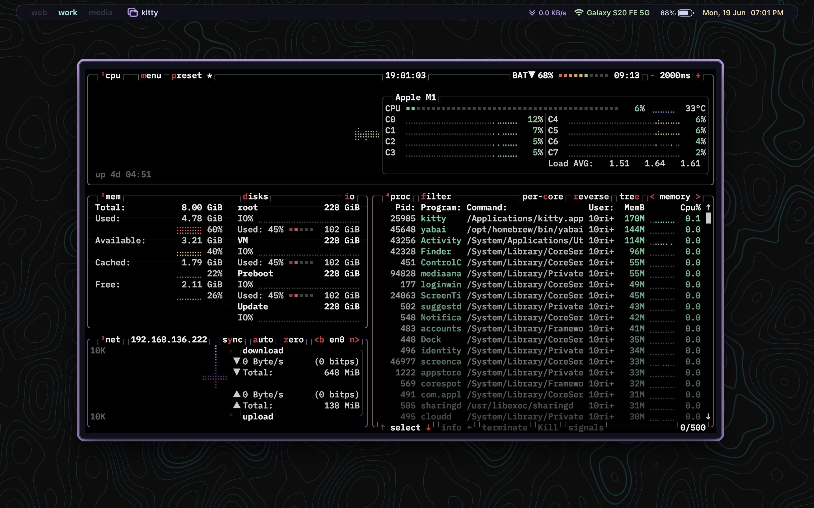
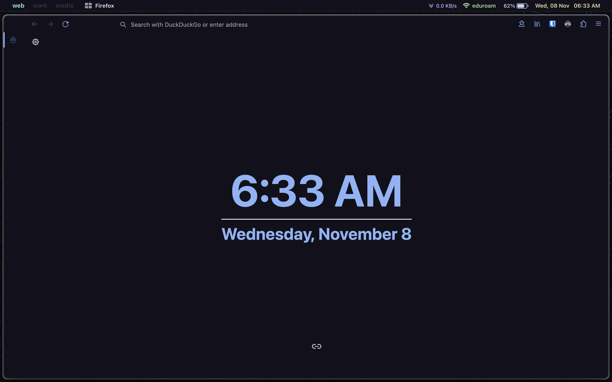

# My Dotfiles

| OS                | macOS Ventura     |
| :--------------:  | :---------------: |
| CPU               | Apple M1          |
| Theme             | [Catppuccin Mocha](https://github.com/catppuccin/catppuccin) |
| WM                | [yabai](https://github.com/koekeishiya/yabai) |
| Bar               | [sketchybar](https://github.com/FelixKratz/SketchyBar) |
| Package Manager   | [brew](https://github.com/Homebrew/brew) |
| Editor            | [neovim](https://github.com/neovim/neovim) |
| Terminal          | [Kitty](https://github.com/kovidgoyal/kitty) |
| Terminal Font     | [Geist Mono Nerd Font](https://github.com/ryanoasis/nerd-fonts/tree/master/patched-fonts/GeistMono) |
| File Manager      | [lf](https://github.com/gokcehan/lf) |
| Browser           | Firefox (with [cascade](https://github.com/andreasgrafen/cascade)) |

