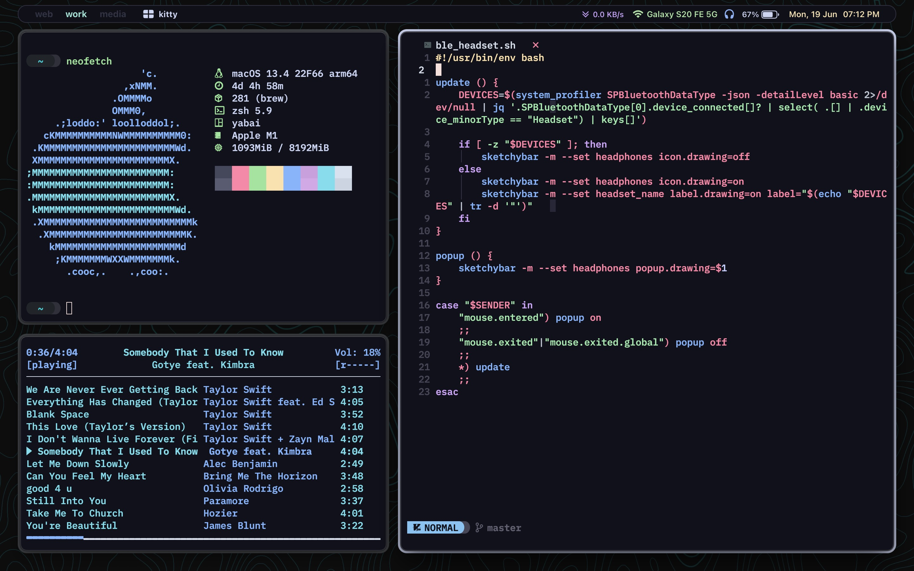
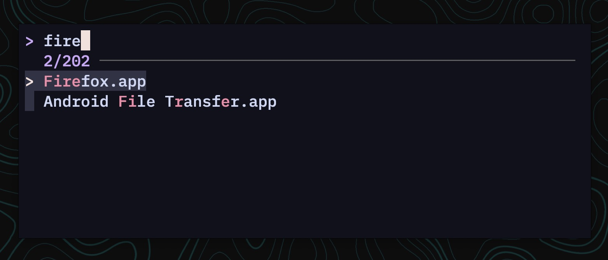

# My Dotfiles



| OS                | macOS Ventura     |
| :--------------:  | :---------------: |
| CPU               | Apple M1          |
| Theme             | [Catppuccin Mocha](https://github.com/catppuccin/catppuccin) |
| WM                | [yabai](https://github.com/koekeishiya/yabai) |
| Bar               | [sketchybar](https://github.com/FelixKratz/SketchyBar) |
| Package Manager   | [brew](https://github.com/Homebrew/brew) |
| Editor            | [neovim](https://github.com/neovim/neovim) using [NvChad](https://github.com/NvChad/NvChad) config |
| Terminal          | [Kitty](https://github.com/kovidgoyal/kitty) |
| Terminal Font     | [IBM Plex Mono Nerd Font](https://github.com/ryanoasis/nerd-fonts/tree/master/patched-fonts/IBMPlexMono) |
| App Launcher      | [Custom script](https://github.com/rish106/dotfiles#app-launcher) |
| File Manager      | [lf](https://github.com/gokcehan/lf) |
| Browser           | Firefox (with [cascade](https://github.com/andreasgrafen/cascade)) |


## neovim setup
I use NvChad with the catppuccin mocha theme. To use my config
- Download NvChad using
```zsh
git clone https://github.com/NvChad/NvChad ~/.config/nvim --depth 1
```
- Paste the files in my nvim/lua/custom folder in your .config/nvim/lua/custom
- Run PackerSync
```zsh
nvim +PackerSync
```

## App Launcher


Spawns an instance of terminal and runs the fuzzy finder on app directories using the popup and launcher scripts present in [scripts](https://github.com/rish106/dotfiles/blob/master/scripts)
